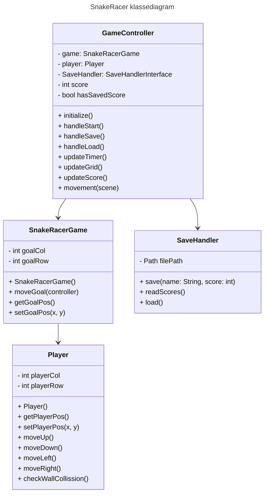

# TDT4100 Dokumentasjon prosjekt

## Beskrivelse
 -  Som prosjekt i faget TDT4100 har jeg valgt å lage en forenklet/alternativ versjon av spillet Snake. Spillet
    heter SnakeRacer, og går ut på å fange så mange gule brikker som mulig før tiden går ut. Spilleren styrer en rød brikke, 
    og har 15 sekunder på seg til å fange brikkene, fra man trykker på start-knappen. Spilleren flytter seg rundt i 
    et 16 x 16-rutenett, og har mulighet til å gå gjennom vegger. 

## Diagram: 

## Spørsmål

1. Gjennom prosjektet dekker jeg de fleste delene av pensum. Jeg bruker innkapsling av metoder innad i klassene, 
    jeg tar i bruk et interface gjennom SaveHandler-klassen, og jeg bruker JUnit-tester for å teste koden. I tillegg har jeg brukt mye delegering, da jeg har hatt behov for å bruke mange av metodene fra en klasse i flere andre klasser. Selve spillet baserer seg også på lister/arrays, da jeg bruker arrays for å representere spilleren og målets posisjon. Generelt vil jeg si at jeg har brukt mesteparten av pensum gjennom prosjektet.

2.  Det er flere teknikker jeg ikke har tatt i bruk i prosjektet, for eksmpel har jeg 
    ikke tatt i bruk observatør-observert teknikk, eller en comparable/iterable-teknikk. Jeg kunne for eksmempel brukt 
    en comparable-comparator i Player-klassen, for å sammenligne ulike scores, og igjen bruke den for å sortere highscores-listen. Jeg kunne også vært flinkere på å ta i bruk toString()-metoder for å debugge og feilsøke koden. Jeg har heller ikke brukt noe arv, og føler ikke at jeg har hatt noe veldig behov for å ta det i bruk heller. Jeg tror det kunne vært veldig effektiv om jeg senere skulle lagt til mer funksjonalitet i spillet, for eksempel å ha ulike typer brikker på rutefeltet. 

3. Koden følger Model-View-Controller-prinsippet i stor grad, da jeg føler at jeg har fått delt opp mesteparten av koden på en 
    ryddig og logisk måte. Jeg har det meste av spill-logikken i SnakeRacerGame- og Player-klassen, og har nesten alt av GUI i 
    FXML-filen. Derimot føler jeg at jeg endte med en del spill-logikk i Controller-klassen, som jeg kanskje kunne gjort annerledes. Det var ikke like enkelt å bruke Controller-klassen som et bindeledd uten å implementere noe spill-logikk og metoder. 

4. For å kjøre tester på koden valgte jeg først å skrive tester for spill-konstruktøren. Dette for å forsikre meg om at spillet
    ble initialisert på riktig måte. Deretter skrev jeg tester for fillagring-delen av prosjektet. Jeg testet save()-metoden og 
    readScores()-metoden i SaveHandler-klassen, som er viktige metoder for at fillagringen skal gå i orden. Til slutt skre jeg
    tester for å teste bevegelse-metodene i Player-klassen. Disse testet jeg for å forsikre meg om at spiller-brikken faktisk
    beveger seg riktig, og at logikken når spilleren traff en vegg var riktig. Jeg burde også ha skrevet tester for 
    GameController-klassen, men dette følte jeg ble vanskelig da nesten alle metodene bruker metoder fra de andre klassene. Jeg valgte derfor å heller skrive tester som jeg selv forstår meg på, og ikke bruke for mye hjelpemidler på å teste noen få metoder.
